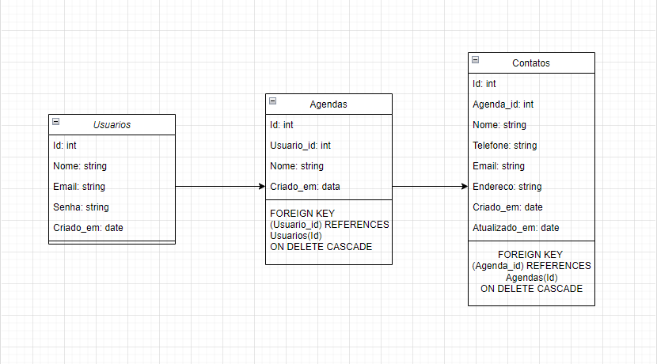

# API de Agenda de Contatos

Este é o repositório da API para uma **Agenda de Contatos**, desenvolvida em **C#** utilizando **ASP.NET Core** e **Entity Framework Core**. A API permite que os usuários gerenciem suas agendas, criando, editando e excluindo contatos.

## Índice

- [Sobre o Projeto](#sobre-o-projeto)
- [Estrutura do Banco de Dados](#estrutura-do-banco-de-dados)
- [Instalação](#instalação)
- [Uso](#uso)
- [Endpoints da API](#endpoints-da-api)
- [Esquema de Arquitetura do Projeto](#esquema-de-arquitetura-do-projeto)

## Sobre o Projeto

Esta API permite que os usuários gerenciem suas agendas de contatos pessoais. Cada usuário pode ter múltiplas agendas, e em cada agenda, vários contatos podem ser cadastrados. A API suporta operações de **CRUD** (Create, Read, Update, Delete) para usuários, agendas e contatos.

## Estrutura do Banco de Dados

A estrutura do banco de dados é composta pelas seguintes tabelas:

- **Usuarios**: Armazena informações sobre os usuários.
- **Agendas**: Relaciona os usuários com suas agendas.
- **Contatos**: Armazena os contatos que pertencem a uma agenda.

### Modelo do banco de dados:

#### 1. `Usuarios`

```sql
CREATE TABLE Usuarios (
    id INT PRIMARY KEY AUTO_INCREMENT,
    nome VARCHAR(100) NOT NULL,
    email VARCHAR(100) UNIQUE NOT NULL,
    senha VARCHAR(100) NOT NULL, -- De preferência, usando hash
    criado_em TIMESTAMP DEFAULT CURRENT_TIMESTAMP
);
```

#### 2. `Agendas`

```sql
CREATE TABLE Agendas (
    id INT PRIMARY KEY AUTO_INCREMENT,
    usuario_id INT NOT NULL,
    nome VARCHAR(100) NOT NULL,
    criado_em TIMESTAMP DEFAULT CURRENT_TIMESTAMP,
    FOREIGN KEY (usuario_id) REFERENCES Usuarios(id) ON DELETE CASCADE
);
```

#### 3. `Contatos`

```sql
CREATE TABLE Contatos (
    id INT PRIMARY KEY AUTO_INCREMENT,
    agenda_id INT NOT NULL,
    nome VARCHAR(100) NOT NULL,
    telefone VARCHAR(20),
    email VARCHAR(100),
    endereco VARCHAR(255),
    criado_em TIMESTAMP DEFAULT CURRENT_TIMESTAMP,
    atualizado_em TIMESTAMP DEFAULT CURRENT_TIMESTAMP ON UPDATE CURRENT_TIMESTAMP,
    FOREIGN KEY (agenda_id) REFERENCES Agendas(id) ON DELETE CASCADE
);
```

## Instalação

Siga os passos abaixo para rodar este projeto localmente:

### Pré-requisitos:
- .NET 6.0 SDK
- SQL Server

### Passos:

1. Clone o repositório:

   ```bash
   git clone https://github.com/GustavoRossii/Contatos
   cd SistemaDeTarefas
   
  
2. Configure a string de conexão no arquivo `appsettings.json` com os detalhes do seu banco de dados:

   ```json
   {
     "ConnectionStrings": {
       "DefaultConnection": "Server=.;Database=AgendaDeContatosDB;Trusted_Connection=True;"
     }
   }

3. Restaure as dependências do projeto:

  ```bash
  dotnet restore
```

4. Execute as migrações para criar o banco de dados:
   ```bash
   dotnet ef migrations add InitialCreate
   ```

   ```bash
   dotnet ef database update
   ```
5. Execute a aplicação:
   ```bash
   dotnet run
  

## Uso

A API oferece os seguintes recursos:

- **Gerenciamento de Usuários**: Criação, atualização, leitura e exclusão de usuários.
- **Gerenciamento de Agendas**: Criação de múltiplas agendas para cada usuário.
- **Gerenciamento de Contatos**: Adicionar, editar e excluir contatos de uma agenda específica.

## Endpoints da API

### Usuários
- `GET /api/usuarios`: Retorna todos os usuários.
- `GET /api/usuarios/{id}`: Retorna um usuário por ID.
- `POST /api/usuarios`: Cria um novo usuário.
- `PUT /api/usuarios/{id}`: Atualiza um usuário existente.
- `DELETE /api/usuarios/{id}`: Deleta um usuário.

### Agendas
- `GET /api/agendas`: Retorna todas as agendas.
- `GET /api/agendas/{id}`: Retorna uma agenda por ID.
- `POST /api/agendas`: Cria uma nova agenda.
- `PUT /api/agendas/{id}`: Atualiza uma agenda existente.
- `DELETE /api/agendas/{id}`: Deleta uma agenda.

### Contatos
- `GET /api/contatos`: Retorna todos os contatos.
- `GET /api/contatos/{id}`: Retorna um contato por ID.
- `POST /api/contatos`: Cria um novo contato.
- `PUT /api/contatos/{id}`: Atualiza um contato existente.
- `DELETE /api/contatos/{id}`: Deleta um contato.

## Esquema de Arquitetura do Projeto



